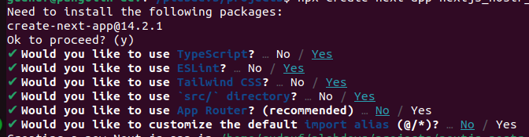

# Nostr App Template For Building Nostr Apps with NDK + Next.JS

We'll leverage Next.js and the [NDK (Nostr Dev Kit)](https://github.com/nostr-dev-kit/ndk) to create a template.

# Table of Contents

1. [Create a new Next.JS App](#create-a-new-nextjs-app)
2. [Install NDK](#install-ndk)
3. [Create `useNDK()` Hook](#create-usendk-hook)
   - [Create `src/hooks/useNDK.tsx`](#create-srchooksusendktsx)
   - [NDK Context Provider](#ndk-context-provider)
4. [Provide NDK to the App](#provide-ndk-to-the-app)
5. [Instantiate NDK](#instantiate-ndk)
6. [Connect to Relays](#connect-to-relays)
7. [Build a Function](#build-a-function)
8. [Implement `subscribeAndHandle`](#implement-subscribeandhandle)

## Create a new Next.JS App

We will be using typescript. If you are learning how to code, then TypeScript may be challenging, but starting to understand types is extemley valuable. If anything is confusing, simply paste it into Chat-GPT and you should get an decent explanation.

Use `npx` to start a new app. `npx` comes from installing [Node.JS](https://nodejs.org/)

```bash
npx create-next-app
```

Then, provide the following answers to the proceeding prompts.



We choose yes for eslint to improve readability of our code, and yes to tailwind to make building out your UI efficient.

## Install NDK

```bash
npm install @nostr-dev-kit/ndk
```

## Create `useNDK()` Hook

NDK provides a lot of utilities for building on nostr. If its a part of the [NIPs repo](https://github.com/nostr-protocol/nips), then NDK probably has it.

### Create `src/hooks/useNDK.tsx`

```bash
mkdir src/hooks && touch src/hooks/useNDK.tsx
```

Open the newly created file and start building out your hook!

### NDK Context Provider

React context providers allow components to consume data without manually passing props through every level of the component tree (aka prop drilling).

Start by writing the basic structure of the provider, and export the `useNDK` hook with `NDKContext` so that everytime you use `useNDK()`, it references the state of the provider.

```javascript
import React from "react";

type NDKContextType = {};

let NDKContext: React.Context<NDKContextType>;

export const NDKProvider = ({ children }: { children: React.ReactNode }) => {
  const contextValue = {};

  NDKContext = React.createContext(contextValue);

  return (
    <NDKContext.Provider value={contextValue}>{children}</NDKContext.Provider>
  );
};

export const useNDK = () => React.useContext(NDKContext);
```

## Provide NDK to the App

Now, provide NDK to the app in `src/pages/_app.tsx`. This is what makes the `useNDK` hook be global.

```javascript
import "@/styles/globals.css";
import type { AppProps } from "next/app";
import { NDKProvider } from "@/hooks/useNDK";

export default function App({ Component, pageProps }: AppProps) {
  return (
    <NDKProvider>
      <Component {...pageProps} />
    </NDKProvider>
  );
}
```

## Instantiate NDK

Now we have to create a global NDK instance.

1. import `NDK`
2. Add `ndk` to the `NDKContextType`
3. Instantiate an `ndk` instance
4. Return it in the `contextValue` within `NDKProvider`

```javascript
...

import NDK from "@nostr-dev-kit/ndk";

type NDKContextType = {
  ndk: NDK;
};

...

export const NDKProvider = ({ children }: { children: React.ReactNode }) => {
  // create a new NDK instance to be used throughout the app
  const ndkLocal = new NDK();

  // use a ref to keep the NDK instance in scope for the lifetime of the component
  const ndk = React.useRef(ndkLocal);

...

  // Define what will be returned by useNDK();
  const contextValue = {
    ndk: ndk.current,
    subscribeAndHandle,
  };

...

```

## Connect to Relays

Now, define the relays that ndk should connect to.

These relays are what your app will use to read and write to nostr unless specified otherwise.

1. Create an array of relay urls.
2. Add the array to the `new NDK` options as `explicitRelayUrls`
3. Call `ndk.connect()` to conenct to the relays

```javascript

...

// Find relays at https://nostr.watch
const defaultRelays = ["wss://lunchbox.sandwich.farm"];

...

export const NDKProvider = ({ children }: { children: React.ReactNode }) => {
  // create a new NDK instance to be used throughout the app
  const ndkLocal = new NDK({ explicitRelayUrls: defaultRelays });

  // use a ref to keep the NDK instance in scope for the lifetime of the component
  const ndk = React.useRef(ndkLocal);

  // Normally ndk.connect should be called asynchrounously, but in this case the instance will connect to the relays soon after the app loads
  ndk.current
    .connect() // connect to the NDK
    .then(() => console.log("Connected to NDK")) // log success
    .catch(() => console.log("Failed to connect to NDK")); // log failure

...

```

## Build a Function

Finally, we can create functions and use them in our app!

We will create a simple `subscribeAndHandle` function.

To do this, we define `subscribeAndHandle` within the `NDKProvider`, and then make sure to add to the `contextValue` and `NDKContextType`.

This is what the final product of your hook should look like:

```javascript
import React from "react";
import NDK, {
  NDKEvent,
  NDKFilter,
  NDKSubscriptionOptions,
} from "@nostr-dev-kit/ndk";

// Find relays at https://nostr.watch
const defaultRelays = ["wss://lunchbox.sandwich.farm"];

// Define the data that will be returned by useNDK();
type NDKContextType = {
  ndk: NDK,
  subscribeAndHandle: (
    filter: NDKFilter,
    handler: (event: NDKEvent) => void,
    opts?: NDKSubscriptionOptions
  ) => void,
};

// define this outside of the below NDKProvider component so that it is in scope for useNDK()
let NDKContext: React.Context<NDKContextType>;

export const NDKProvider = ({ children }: { children: React.ReactNode }) => {
  // create a new NDK instance to be used throughout the app
  const ndkLocal = new NDK({ explicitRelayUrls: defaultRelays });

  // use a ref to keep the NDK instance in scope for the lifetime of the component
  const ndk = React.useRef(ndkLocal);

  // Normally ndk.connect should be called asynchrounously, but in this cast the instance will connect to the relays soon after the app loads
  ndk.current
    .connect() // connect to the NDK
    .then(() => console.log("Connected to NDK")) // log success
    .catch(() => console.log("Failed to connect to NDK")); // log failure

  /**
   *
   * @param filter An NDKFilter for specific events
   * @param handler A function that accepts an NDKEvent and does something with it
   * @param opts Optional NDKSubscriptionOptions. Set `{closeOnEose: false}` to keep subscriptions open after eose
   */
  const subscribeAndHandle = (
    filter: NDKFilter,
    handler: (event: NDKEvent) => void,
    opts?: NDKSubscriptionOptions
  ) => {
    // subscribe to the filter
    const sub = ndk.current.subscribe(filter, opts);

    // `sub` emits 'event' events when a new nostr event is received
    // our handler then processes the event
    sub.on("event", (e: NDKEvent) => handler(e));
  };

  // Define what will be returned by useNDK();
  const contextValue = {
    ndk: ndk.current,
    subscribeAndHandle,
  };

  // create a new context with the contextValue
  NDKContext = React.createContext(contextValue);

  // Return our new provider with `children` as components that will be wrapped by the provider
  return (
    <NDKContext.Provider value={contextValue}>{children}</NDKContext.Provider>
  );
};

// This is the hook that will be used in other components to access the NDK instance
export const useNDK = () => React.useContext(NDKContext);
```

## Implement `subscribeAndHandle`

And update `/pages/index.tsx` to implement the function.

1. Import the `useNDK` hook and types from `@nostr-dev-kit/ndk`
2. get `subscribeAndHandle` from the hook.
3. Use a `useEffect` to define a filter, a handler, and finally subscribe and handle.
4. Render the `mostrRecentEvent` defined with `useState`

```javascript
import { useEffect, useState } from "react";
import { useNDK } from "@/hooks/useNDK";
import { NDKEvent, NDKFilter, NDKKind } from "@nostr-dev-kit/ndk";

export default function Home() {
  const [mostRecentEvent, setMostRecentEvent] = useState({});

  const { subscribeAndHandle } = useNDK();

  useEffect(() => {
    const filter: NDKFilter = {
      kinds: [NDKKind.Text],
    };

    const handler = (event: NDKEvent) => {
      setMostRecentEvent(event.rawEvent());
    };

    subscribeAndHandle(filter, handler, { closeOnEose: true });
  });

  return (
    <main className="flex min-h-screen flex-col items-center justify-between p-24">
      <div className="w-1/2 mx-auto bg-gray-600 p-4 rounded-lg shadow-lg overflow-auto">
        <pre className="whitespace-pre-wrap">
          {JSON.stringify(mostRecentEvent, null, 2)}
        </pre>
      </div>
    </main>
  );
}
```

Now, if you run the app with `npm run dev` you should see a bunch of events flash before your eyes!

## Challenge

The filter we created above subscribes to all kind 1 events.

Try to change the filter so that it will only pull kind 1 events from a specic pubkey (hint: `author`). Refer to [NIP 01](https://github.com/nostr-protocol/nips/blob/master/01.md#from-client-to-relay-sending-events-and-creating-subscriptions)
Another hint: filters take the _hex_ pubkey, not the npub.
